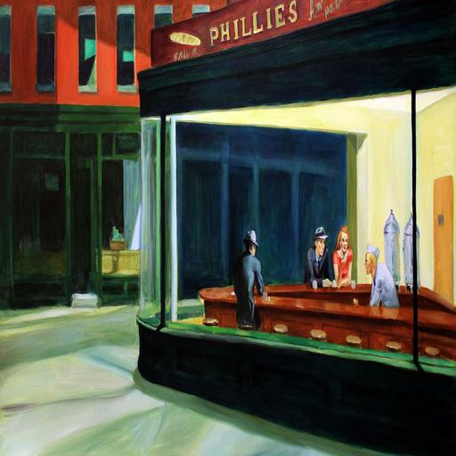
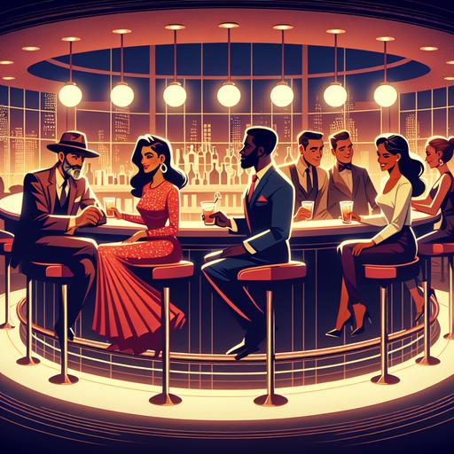
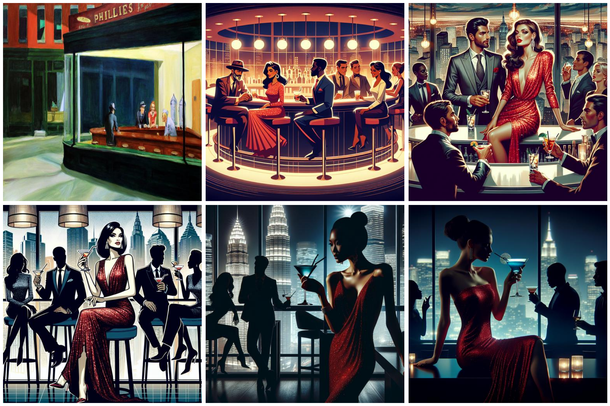
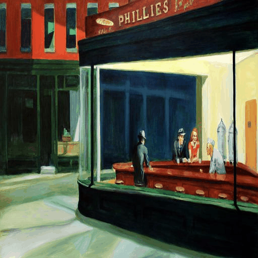

# MS 38 Final Project. 
Blake Buckner - December 8th 2024

This is my MS 38 Final Project. 
This is a program designed to mix computer vision and image generation to make AI automatically play the game telephone with itself. For full use see the [Main Jupyter Notebook](image2text2image.ipynb).


This uses the OpenAI Models gpt4o-mini and dall-e, which means to use it you must have an OpenAI api key and some token credits for its use. This means it is not quite free to actually use but the costs are still very minimal. If desired this code could be expanded to use other fully free models but I do not have a direct way to integrate them and they are would likely be worse quality.

To show this I will be using the example of my favorite painting: Nighthawks by Edward Hopper

### Nighthawks Image


This image is the original Nighthawks painting which was resized and streched to be 512 by 512 pixels. This means there will be some distortion but still maintains most of the detail. Being the original image to be used, its url will be what the user needs to add. The program will work for the majority of image url, but I have ran into instances where urls do not work. In this case I would suggest just finding the same image but hosted under a different url. A little trick I have learned is that if you send an image file even in a private server on discord, you can copy the link and it will be fully uploaded and hosted by discord.

## Describing the image

Following the image upload my program will feed the image into gpt4o-mini and provide it instructions given. This should be something involving how to describe the image.

For my example the following was the output description for that input Nighthawks image:

```plaintext
The scene depicts a diner at night, illuminated warmly. Five patrons are seated at a curved bar. A man in a hat faces left, while two women, one in red, engage with a friendly bartender.
```

This becomes the prompt that will be fed into the desired Dall-e model. 

## Image Generation

Here is the first example image that the Dall-e model generated from that first generated description.



## Telephone

Now that a new image is made, we procede with the telephone game. The new image is sent back to the description model exactly like was done with the original input image. This will repeat for the input number of times, playing through that many rounds of telephone. As it is currently designed the rounds include both the description and generation steps, meaning it will always end with an image.

## Results

To show the resulting game, I generate a grid of each image. Afterwards a gif is also provided with each image description shown. In this example case I set this to be a 6 round game, where each image can be described with 200 characters and uses the better Dalle-3 version

### Game Grid


### Game Gif


### Image Descriptions
```plaintext
The scene depicts a diner at night, illuminated warmly. Five patrons are seated at a curved bar. A man in a hat faces left, while two women, one in red, engage with a friendly bartender.

A stylish bar scene features two men in suits and a glamorous woman in a sparkling red dress at a circular counter. Others enjoy drinks, illuminated by warm lights and city views.

A glamorous bar scene features a woman in a sparkly red dress confidently seated. Surrounding her are stylishly dressed men and women, enjoying cocktails against a city skyline backdrop.

A glamorous scene in a city bar features a woman in a sparkling red gown holding a cocktail. Silhouetted figures in chic attire sit nearby, with skyscrapers visible through large windows.

In a dimly lit, upscale bar with city skyline views, a woman in a shimmering red dress holds a blue cocktail. Silhouettes of two figures animate the scene, contributing to the glamorous atmosphere.

A glamorous woman in a sparkling red dress sips a blue cocktail, silhouetted against a city skyline. Two men and a woman in the background hold drinks, adding to the sophisticated nightlife ambiance.
```

## Final
A file is also saved containing all of the innitial parameters that were given so that it is known what settings were actual used and could be reused to get a similar result. This leaves us with the full output. Within the folder labeled by the input name, we have a file for image gif, the image grid, a txt file for the descriptions, a txt file for the settings, and each of the images involved in the game.


